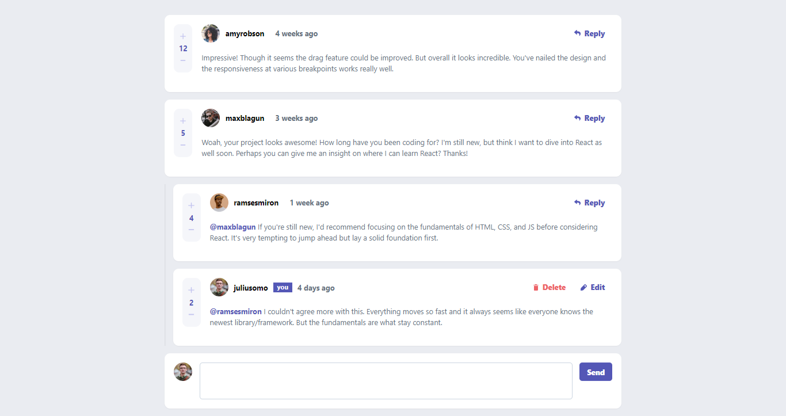
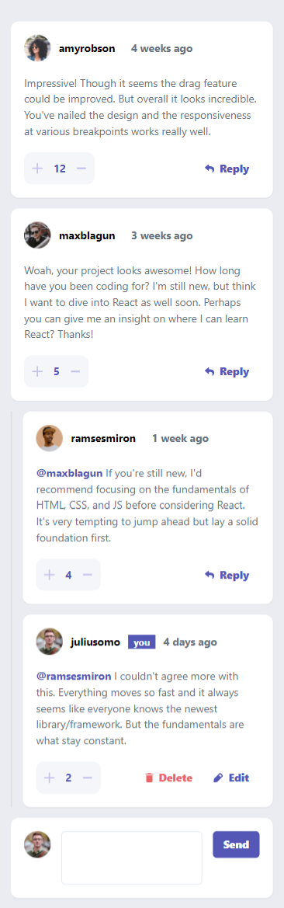

# Frontend Mentor - Interactive comments section solution

This is a solution to the [Interactive comments section challenge on Frontend Mentor](https://www.frontendmentor.io/challenges/interactive-comments-section-iG1RugEG9). Frontend Mentor challenges help you improve your coding skills by building realistic projects. 

## Table of contents

- [Overview](#overview)
  - [The challenge](#the-challenge)
  - [Screenshot](#screenshot)
  - [Links](#links)
- [My process](#my-process)
  - [Built with](#built-with)
  - [What I learned](#what-i-learned)
  - [Continued development](#continued-development)
  - [Useful resources](#useful-resources)
- [Author](#author)

**Note: Delete this note and update the table of contents based on what sections you keep.**

## Overview

### The challenge

Users should be able to:

- View the optimal layout for the app depending on their device's screen size
- See hover states for all interactive elements on the page
- Create, Read, Update, and Delete comments and replies
- Upvote and downvote comments
- **Bonus**: If you're building a purely front-end project, use `localStorage` to save the current state in the browser that persists when the browser is refreshed.
- **Bonus**: Instead of using the `createdAt` strings from the `data.json` file, try using timestamps and dynamically track the time since the comment or reply was posted.

### Screenshot




### Links

- Solution URL: [Source Code](https://github.com/blaqbox-prime/interactive_comments)
- Live Site URL: [Interactive Comments Live](https://comments-component-react.web.app/)


### Built with

- Mobile-first workflow
- [React](https://reactjs.org/) - JS library
- [Firebase Hosting](https://firebase.com/) - React framework
- [Chakra UI](https://styled-components.com/) - For styles

### What I learned

I got to learn quite a bit about Chakra UI and I have thoroughly enjoyed working with it. There's still a lot to learn with Chakra UI and I intend to use it a lot more on future projects. I don't think I was using the useState hook correctly so, please, any commentary and advice is will be appreciated. 

The composition of components is something I realized I need to work on a little more. I found myself constantly battling between making very similar components separate or building one highly customizable component using props and some logic to control it's rendering.

The Sorting of Comments was a Real Pain in my Butt* 
It works (Thank God) but I feel it could have been done a little better.
Just couldn't figure it out.

```js
export const bubbleSort = (array) => {
  let isSorted = false;
  let temp;
  let sortedArray = array;

  while (isSorted === false) {
    for (let i = 0; i < sortedArray.length-1; i++) {
      // check adjacent values 
      if(sortedArray[i] > sortedArray[i+1]){
        // if not in order set sorted to false
        isSorted = false;
        // switch the positions
        temp = sortedArray[i];
        sortedArray[i] = sortedArray[i+1];
        sortedArray[i+1] = temp;
      } else {
        isSorted = true;
      }
    }    
  }

  return sortedArray;
}
```
The Sort function inside the ContextProvider I used for handling the comments. (React useContext)

```js
  // sort Comments
    function sortByScore(comments) {
        let scores = comments.map((comment) => Number(comment.score));
        
        // 1. convert array to set so we only have unique score values
        // 2. convert resulting set back to array because it's easier to manipulate
        // 3. sort by score in ascending order 
        let uniqueScoresOrdered = bubbleSort(setToArray(arrayToSet(scores)));
        let orderedComments = [];

        // reverse the scores order
        // filter comments for each score and append to orderedComments
        uniqueScoresOrdered.reverse().forEach((score) => {
            orderedComments = [ ...orderedComments ,...comments.filter((comment) => comment.score === score)];
        });

        return orderedComments;
    }
```


I used functions to build screen specific layouts for mobile and desktop
as a result some of the code is duplicated with slight changes in the order of the lines
but essentially the same code 
I don't think this was the best way to do it. but, it was a way to get around it. 
```js
const _buildActionsDesktopView = () => {
    return window.screen.width > 960 &&
      <Box className='commentActions'>
      {/* Delete Button (Rendered Conditionally) */}
      {AuthUser.username === user.username &&
        <IconButtonWithText
        buttonType={'delete'}
        value={'delete'}
        onClick={ (e) => _handleClick(e)}
        >
        Delete
      </IconButtonWithText>
      }
    {/* Reply Button */}
    {AuthUser.username === user.username ?
            <IconButtonWithText
            buttonType={'edit'}
            value={'edit'}
            onClick={ (e) => _handleClick(e)}
            >
            Edit
          </IconButtonWithText>
          :
          <IconButtonWithText
          buttonType={'reply'}
          value={'reply'}
          onClick={ (e) => _handleClick(e)}
          >
          Reply
        </IconButtonWithText>
          }

    </Box>
  }

  const _buildCounterDesktopView = () => {
    return window.screen.width > 960 &&
        <Box marginRight={5} width={'40px'}>
          <Flex className='score_counter_desktop' alignItems={'center'} direction='column' justifyContent="space-between" p={3} bg={'very_light_gray'} borderRadius={'xl'}>
          <AddIcon as={'button'} fontSize={'.8rem'} my={2} color={'light_grayish_blue'} cursor={'pointer'} onClick={() => incrementUpvote(id,parentId)} 
          _hover={{color: "moderate_blue"}}
          />
          <Text fontWeight={'bold'} color={'moderate_blue'} mx={4}>{score}</Text>
          <MinusIcon as={'button'} my={2} fontSize={'.8rem'} color={'light_grayish_blue'} cursor={'pointer'} onClick={() => decrementUpvote(id,parentId)} 
          _hover={{color: "moderate_blue"}}
          />
          </Flex>
        </Box>
  }
```


### Continued development

I am looking to start working with animations soon as I have yet to really give it a good, consistent effort. State management and routing in react are also a pain I have to work on fixing. javascript testing has also been on the table for some time and even though I've kind of started with that, I haven't done nearly enough. The road for a dev always seems unending but a little bit every day. 

### Useful resources

- [Chakra UI Docs](https://chakra-ui.com/) - First time building a Chakra UI project and this, obviously, was the best place to go and I loved it. Will surely be using it more often

## Author
- Github - [@blaqbox-prime](https://www.github.com/blaqbox-prime)
- Instagram - [@ig_blaqbox.dev](https://www.instagram.com/ig_blaqbox.dev)
- Frontend Mentor - [@blaqbox-prime](https://www.frontendmentor.io/profile/blaqbox-prime)
- Twitter - [@karabosambo_](https://www.twitter.com/karabosambo_)
